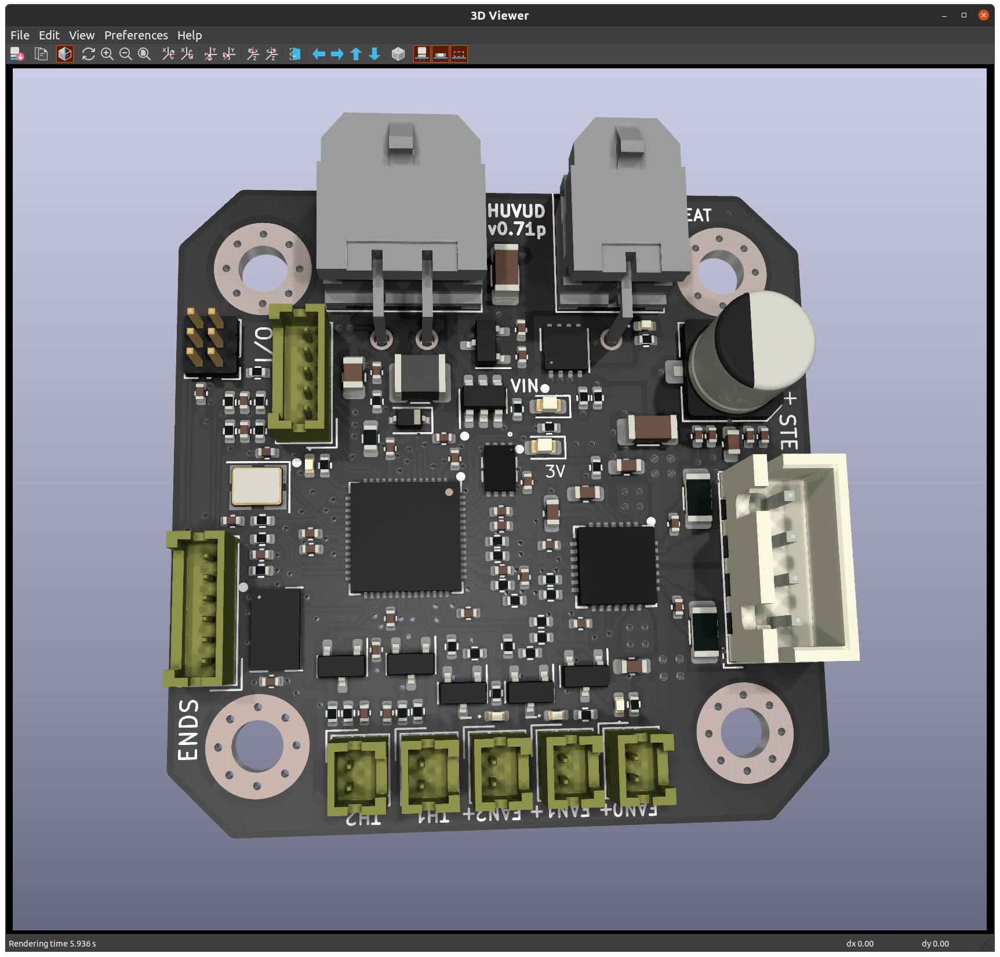

# Huvud 3D Printer toolhead board
This is a modified version of the KilipperBoard started by bondus(https://github.com/bondus/KlipperToolboard). The goal is to make the board as cheap as possible. Removed the CAN interface, switched to RP4020 MCU since it is more available. Added extra IO pins for LEDs or other sensors.
# Original author words
A very small 3D printer board for use on a direct drive toolhead. It is designed to be used with Klipper firmware. Klipper has the awesome feature to be able to use multiple MCUs connected to the host over a (relatively) high latency connection.

Features: 
* One TMC2209 stepper driver for the extruder
* Three MOSFETs for fans
* One big MOSFET for the hotend heater
* Two thermistor inputs
* ADXL345 accelerometer for resonance testing
* Support for 3 endstops
* 3 extra I/O pins for RGB LEDs or other functions
* RP4020 Dual core 133MHz 32bit ARM MCU
* USB, for flashing firmware

Main power is 12-24V. 24V is preferred to keep the currents low

All done in KiCad and open source. 

If you are interesting in helping out, testing or eventually using this board feel free to contact me at ghent360@iqury.us.

### Documentation

* [Pinout and hook up](doc/pinout.md)
* [Klipper configuration](doc/klipper.md)
* [Prototype versions of the board](doc/versions.md)

